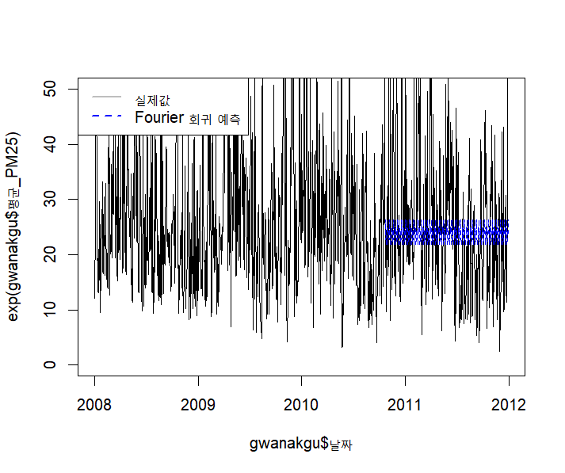
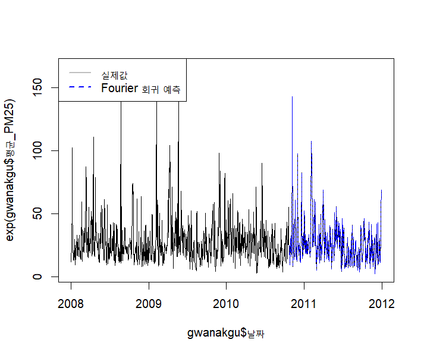

```{r setup, include=FALSE}
knitr::opts_chunk$set(echo = TRUE)
```

# Rmd 파일에 링크 입력하는 방법

문법: '[링크제목](링크주소)'


## 예제

다음의 링크로 저의 
[블로그](https://pastryofjsmath.tistory.com/)에 접속하도록 합시다.

# Rmd 파일에 그림 넣는 방법

그림을 넣는 법에는 크게 두가지 방식이 있다.

1. 마크다운 문법을 사용하여 입력
1. R코드를 이용하여 입력
1. Latex으로 직접입력-> 비추천
* 설정부분에 'urlcolor' 파란색으로 설정

## 마크다운 사용

### 그림 하나 넣기

중요한 점은 코드 줄 바꿈에 있어서 앞뒤에 빈줄이 존재해야 캡션이 달린다.

{width=50%}


](figure1.png){width=50%}


```{r fig1, echo=FALSE, out.width="50%", fig.cap="그림 1. 관악구 PM2.5 실제값과 Fourier 회귀 예측"}

```

{width=40%}\
{width=40%}

\begin{figure}[!h]
\caption{그림파일 설명}
\end{figure}

## R코드로 그림 넣기

### 그림 한 개

```{r eval=FALSE}
knitr::include_graphics("File path")
```

```{r figure1, echo=F, fig.cap='그림 설명부분',fig.align='center',out.width = '50%'}

```

### 그림 여러개

```{r multiple, echo=F, fig.cap='전체 그림 설명',fig.subcap=c('첫번째 그림설명','두번째 그림설명','세번째 그림설명'),out.width='50%',fig.ncol=2,fig.align='center'}


plot(cars,pch=19)